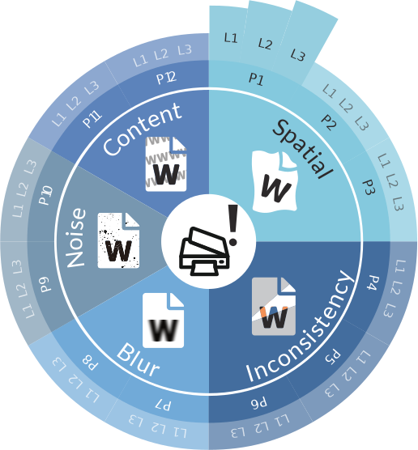

<h1 align="center">📓RoDLA</h1>
<h3 align="center">Benchmarking the Robustness of Document Layout Analysis Models (CVPR'24)</h3>

<p align="center">
    <a href="https://arxiv.org/pdf/2403.14442.pdf">
    </a>
    <a href="https://yufanchen96.github.io/projects/RoDLA/">
    </a>
    <a href="https://pytorch.org/get-started/previous-versions/#linux-and-windows">
    </a>
    <a href="https://github.com/yufanchen96/RoDLA/blob/main/LICENSE">
    </a>
    
</p>

## 🏡 Project Homepage

This is the official repository for our CVPR 2024 paper **RoDLA:Benchmarking the Robustness of Document Layout Analysis Models**. For more result and benchmarking details, please visit our [project homepage](https://yufanchen96.github.io/projects/RoDLA/).
    
## 🔎 Introduction
We introduce **RoDLA** that aims to benchmark the robustness of Document Layout Analysis (DLA) models. RoDLA is a large-scale benchmark that contains **450,000**+ documents with diverse layouts and contents. 
We also provide a set of evaluation metrics to facilitate the comparison of different DLA models. We hope that RoDLA can serve as a standard benchmark for the robustness evaluation of DLA models.
<p align="center">
    
</p>

## 📝 Catalog
- [x] Perturbation Benchmark Dataset
  - [x] PubLayNet-P
  - [ ] DocLayNet-P
  - [ ] M<sup>6</sup>Doc-P
- [x] Perturbation Generation and Evaluation Code
- [ ] RoDLA Model Checkpoints
- [ ] RoDLA Model Training Code
- [x] RoDLA Model Evaluation Code

## 📦 Installation
**1. Clone the repository**
```
git clone https://github.com/yufanchen96/RoDLA.git
cd RoDLA
```

**2. Create a conda virtual environment**
```
# create virtual environment
conda create -n RoDLA python=3.7 -y
conda activate RoDLA
```

**3. Install benchmark dependencies**

- Install Basic Dependencies

```
pip install torch==1.10.2+cu113 torchvision==0.11.3+cu113 torchaudio==0.10.2+cu113 -f https://download.pytorch.org/whl/cu113/torch_stable.html
python -m pip install detectron2 -f https://dl.fbaipublicfiles.com/detectron2/wheels/cu113/torch1.10/index.html
pip install -U openmim
mim install mmcv-full==1.5.0
pip install timm==0.6.11 mmdet==2.28.1
pip install Pillow==9.5.0
pip install opencv-python termcolor yacs pyyaml scipy
```

- Install ocrodeg Dependencies
```
git clone https://github.com/NVlabs/ocrodeg.git
cd ./ocrodeg
pip install -e .
```

- Compile CUDA operators
```
cd ./model/ops_dcnv3
sh ./make.sh
python test.py
```
- You can also install the operator using .whl files

    [DCNv3-1.0-whl](https://github.com/OpenGVLab/InternImage/releases/tag/whl_files)

## 📂 Dataset Preparation

### RoDLA Benchmark Dataset Preparation
Download the RoDLA dataset from Google Driver to the desired root directory.
  - [PubLayNet-P](https://drive.google.com/file/d/1bfjaxb5fAjU7sFqtM3GfNYm0ynrB5Vwo/view?usp=drive_link)
  - [DocLayNet-P]()
  - [M<sup>6</sup>Doc-P]()

### Self-generated Perturbation Dataset Preparation
Prepare the dataset as follows by yourself:
```
cd ./perturbation

python apply_perturbation.py \
      --dataset_dir ./publaynet/val \
      --json_dir ./publaynet/val.json \
      --dataset_name PubLayNet-P \
      --output_dir ./PubLayNet-P \
      --pert_method all \
      --background_folder ./background \
      --metric all
```
### Dataset Structure

After dataset preparation, the perturbed dataset structure would be:
```
.desired_root
└── PubLayNet-P
    ├── Background
    │   ├── Background_1
    │   │   ├── psnr.json
    │   │   ├── ms_ssim.json
    │   │   ├── cw_ssim.json
    │   │   ├── val.json  
    │   │   ├── val
    │   │   │   ├── PMC538274_00004.jpg
    ...
    │   ├── Background_2
    ...
    ├── Rotation
    ...
```

## 🚀 Quick Start

### Evaluate the RoDLA model
```
cd ./model
python -u test.py configs/publaynet/rodla_internimage_xl_2x_publaynet.py \
  checkpoint_dir/rodla_internimage_xl_2x_publaynet.pth \
  --work-dir result/rodla_internimage_publaynet/Speckle_1 \
  --eval bbox \
  --cfg-options data.test.ann_file='PubLayNet-P/Speckle/Speckle/val.json' \
                data.test.img_prefix='PubLayNet-P/Speckle/Speckle/val/'
```

## 🌳 Citation
If you find this code useful for your research, please consider citing:
```
@misc{chen2024rodla,
      title={RoDLA: Benchmarking the Robustness of Document Layout Analysis Models}, 
      author={Yufan Chen and Jiaming Zhang and Kunyu Peng and Junwei Zheng and Ruiping Liu and Philip Torr and Rainer Stiefelhagen},
      year={2024},
      eprint={2403.14442},
      archivePrefix={arXiv},
      primaryClass={cs.CV}
}
```